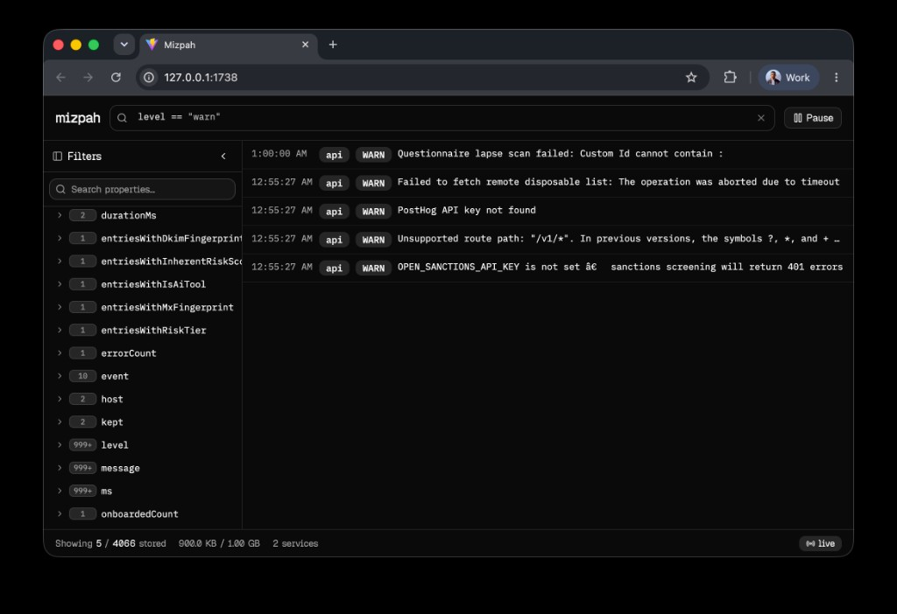

# Mizpah

JSON log viewer with a modern web UI — and an MCP server so Cursor, Claude, and Codex can query your live logs without pasting them into chat.

[](LICENSE)
[](https://github.com/ethira-dev/mizpah/releases/latest)



```bash
my-app 2>&1 | mizpah --service api
```

## Install

### Homebrew

```bash
brew install ethira-dev/mizpah/mizpah
```

### From source

Requirements: [Rust](https://rustup.rs/) (stable) and Node.js 20+.

```bash
# From this repo — puts mizpah on PATH (~/.cargo/bin)
just install

# Without just:
cd web && npm ci && npm run build
cargo install --path crates/mizpah --force
mizpah mcp install
```

`just install` (and the first hub start) register Mizpah as an MCP server in Cursor, Claude Desktop, Claude Code, and Codex when those apps are present. Restart the client after install so tools appear.

If you also have a Homebrew install, ensure `~/.cargo/bin` is before `/opt/homebrew/bin` on `PATH`, or run `~/.cargo/bin/mizpah mcp install` explicitly — an older brew binary will not understand the `mcp` subcommand until the tap is updated.

Then run from anywhere:

```bash
mizpah --help
echo '{"msg":"hi"}' | mizpah --service demo
```

If you get `command not found`, ensure Cargo’s bin dir is on your PATH:

```bash
export PATH="$HOME/.cargo/bin:$PATH"
```

### Prebuilt binaries (GitHub Releases)

After a `v*` tag is published, download the archive for your platform from the [Releases](https://github.com/ethira-dev/mizpah/releases) page:

```bash
# Apple Silicon example
curl -L https://github.com/ethira-dev/mizpah/releases/latest/download/mizpah-aarch64-apple-darwin.tar.gz \
  | tar -xz
mv mizpah ~/.local/bin/   # or: sudo mv mizpah /usr/local/bin/
```

Asset names:

| Platform | Archive |
|----------|---------|
| macOS Apple Silicon | `mizpah-aarch64-apple-darwin.tar.gz` |
| macOS Intel | `mizpah-x86_64-apple-darwin.tar.gz` |
| Linux x86_64 | `mizpah-x86_64-unknown-linux-gnu.tar.gz` |

## Features

- **Required `--service`** — tag each stream; run multiple processes and switch services in the UI
- **Hub + attach** — first process binds `:1738` and serves the UI; later processes forward to it
- **In-memory ring buffer** — default 1 GiB; oldest logs are evicted when full
- **CEL filters** — search bar is a CEL editor with syntax highlighting and autocomplete for discovered properties
- **Property discovery** — nested paths like `user.id` suggested in the editor
- **Live WebSocket stream** — virtualized log list, pause/resume tail
- **Pretty-object reassembly** — Nest-style multiline `{` … `}` dumps become structured JSON when ingest can convert them
- **MCP for agents** — Cursor / Claude / Codex can query the live hub via tools (no pasting logs into chat)

## Usage

```bash
# Hub (starts UI at http://127.0.0.1:1738)
api-server | mizpah --service api

# Attach more services to the same hub
worker | mizpah --service worker
cron   | mizpah --service cron
```

### Filtering (CEL)

The UI filter bar accepts [CEL](https://cel.dev/) expressions. Context variables:

| Binding | Meaning |
|---------|---------|
| `service` | Stream service tag |
| `level` | First of `level` / `severity` / `lvl` in the JSON payload |
| *fields* | Every top-level key from the log JSON (nested maps via `.`) |

Examples:

```cel
service == "api" && level == "error"
msg.contains("timeout") || error.contains("timeout")
has(user.id) && user.id == "42"
level in ["error", "warn"]
msg.matches("(?i)time.?out")
```

Use `contains` for substring match and `matches` for regex (SQL `LIKE`-style patterns). Combine with `&&` / `||`. Empty query matches all logs.

REST: `GET /api/logs?q=<cel>` · `GET /api/properties?q=<search>` (lists all discovered fields with counts) · WebSocket subscribe: `{ "type": "subscribe", "q": "…" }`.

### CLI

| Flag / command | Description |
|----------------|-------------|
| `--service` / `-s` | **Required** in pipe mode. Service name for this stdin stream |
| `--host` | Bind/connect host (default `127.0.0.1`) |
| `--port` / `-p` | Bind/connect port (default `1738`) |
| `--max-bytes` | Ring buffer cap in bytes (default `1073741824`, hub only) |
| `--no-open` | Do not open a browser when starting as hub |
| `mizpah mcp` | Stdio MCP server (talks to the hub at `:1738`, or `MIZPAH_URL`) |
| `mizpah mcp install` | Merge MCP config into Cursor / Claude / Codex |
| `mizpah mcp uninstall` | Remove those MCP entries |

Lines that are not JSON objects are stored as `{ "_raw": "…" }`.

NestJS / `util.inspect`-style multiline object dumps (e.g. `{` then `key: 'value',` lines then `}`) are reassembled into a single JSON object when possible. Prefer NDJSON from your logger when you control the format.

### MCP (Cursor / Claude / Codex)

Point your AI client at the live hub — agents search with CEL and pull small filtered slices instead of dumping the whole buffer into the prompt.

Keep a hub running as usual:

```bash
my-app 2>&1 | mizpah --service api
```

Tools: `search_logs` (CEL), `list_services`, `get_stats`, `list_properties`, and `get_logs_around`.

```bash
mizpah mcp install     # or: first hub start auto-registers
mizpah mcp uninstall   # opt out
```

Homebrew / release-binary installs: run `mizpah mcp install` once after install (or start a hub once). Restart the IDE/client afterward.

## Development

```bash
# Build UI into crates/mizpah/static, then compile
just release
# or
cd web && npm install && npm run build
cargo build --release

./target/release/mizpah --service demo --no-open
```

Useful targets:

```bash
just install    # UI + install binary to ~/.cargo/bin
just ui         # rebuild SPA only
just build      # UI + debug binary
just test       # Rust unit tests
just web-dev    # Vite dev server (proxies to :1738)
just lint-rust  # cargo fmt --check + clippy
just lint-web   # eslint + tsc
just check      # lint-rust + test + lint-web (matches PR CI)
```

Pull requests run the same Rust and web checks via GitHub Actions (`.github/workflows/ci.yml`).

### Architecture

```
stdin --service api ──► try bind :1738
                          ├─ success → hub (Axum + ring buffer + UI)
                          └─ AddrInUse → attach (POST /api/ingest)
```

## License

MIT
