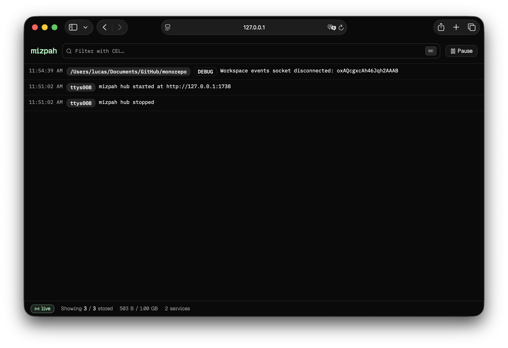
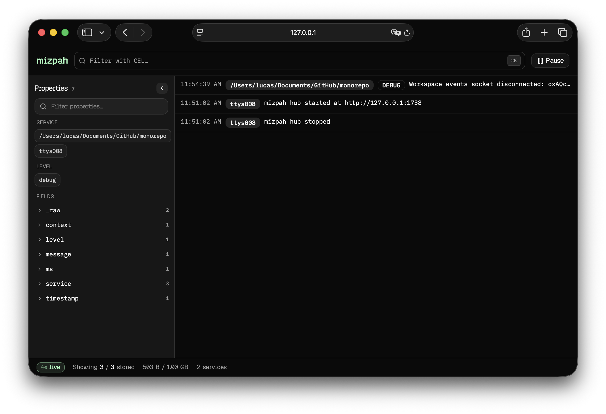
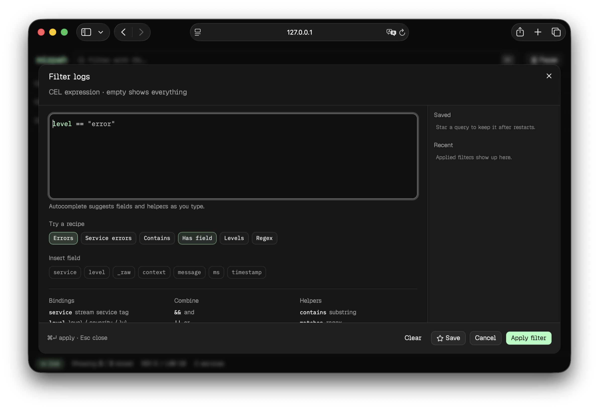
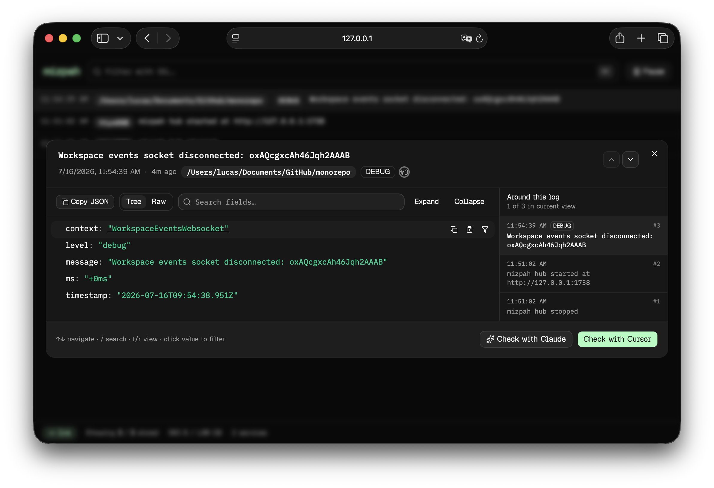

# Mizpah

Stop drowning in `tail -f`. Pipe JSON into **`mzp`**, get a live web UI in under a second, hook your whole shell, and hand the same hub to Cursor, Claude, or Codex — so agents *query* your logs instead of guessing from a paste.

**[Docs & site](https://ethira-dev.github.io/mizpah/)** · [Quick start](https://ethira-dev.github.io/mizpah/docs/quick-start/) · [Install](https://ethira-dev.github.io/mizpah/docs/install/)

[](LICENSE)
[](https://github.com/ethira-dev/mizpah/releases/latest)
[](https://deps.rs/repo/github/ethira-dev/mizpah)









```bash
my-app 2>&1 | mzp --service api
```

## Why Mizpah

- **Live JSON UI, zero SaaS** — local hub on `:1738`, multi-service, virtualized, pause/resume. No account. No Docker compose novel.
- **Attach anything** — `mzp attach shell|browser|cursor|claude` pipes terminal output, Chromium DevTools, or agent lifecycle hooks into the same hub.
- **Filter like you mean it** — [CEL](https://cel.dev/) in the search bar, with autocomplete for every property you’ve actually logged.
- **Agents that can see** — MCP tools so Cursor / Claude / Codex search the live buffer instead of eating a 10k-line dump.
- **One-click investigate** — open a log → **Check with Claude** or **Check with Cursor** and drop into a local agent session already seeded with that entry.

## Get going in 30 seconds

**Pipe a service:**

```bash
api-server 2>&1 | mzp --service api
# UI opens at http://127.0.0.1:1738 — more streams join the same hub automatically
worker | mzp --service worker
```

**Or attach a source:**

```bash
mzp attach              # shell (default) — enable + ensure hub
mzp attach browser --launch
mzp attach cursor       # Cursor agent hooks → hub
mzp attach claude       # Claude Code hooks → hub
mzp open
mzp detach              # shell only
mzp detach cursor       # or: claude | all
```

(`mizpah` is the same binary if you prefer the long name.)

## What you can do

### Watch live JSON logs

First process binds `:1738` and serves the UI. Everything else attaches. Tag streams with `--service` (defaults to absolute cwd), switch services in the UI, and keep a 1 GiB in-memory ring buffer hot without shipping logs to the cloud.

Every row gets a reserved `_mzp` object identifying the Mizpah receiver: `cwd` (terminal folder), `user`, `pid`, and `exe`.

Pretty-printed Nest / `util.inspect` dumps? Mizpah reassembles them into structured JSON when it can. Non-JSON lines land as `{ "_raw": "…" }`. Prefer NDJSON when you control the logger.

```bash
api-server | mzp --service api --project /path/to/repo
```

### Attach sources

`mzp attach` takes a target. Bare `mzp attach` is **shell** (backward compatible).

| Target | What it does |
|--------|----------------|
| `shell` (default) | Tee stdout/stderr from **new** interactive zsh/bash shells |
| `browser` | Chrome/Edge DevTools: console + network (foreground CDP session) |
| `cursor` | Install observe-only Cursor agent hooks → hub |
| `claude` | Install observe-only Claude Code hooks → hub |

```bash
mzp attach                         # shell
mzp attach shell --service my-project
mzp attach browser --launch
mzp attach cursor                  # service default: cursor
mzp attach claude --service agents
mzp detach                         # shell
mzp detach cursor                  # or: claude | all
mzp hub stop                       # also: start / restart
```

#### Shell

Installs shell hooks, starts a background hub if needed, and tees stdout/stderr from **new** interactive shells. Every line gets the command’s absolute cwd (updates after `cd` via `_mzp.cwd`), a `cmd` property with the full command string, and `_mzp` for the shell-forward receiver.

<details>
<summary>Know before you attach shell</summary>

- Captures stdout/stderr that inherit the shell redirect — not typed input, and not TUI apps that write only to `/dev/tty`
- `cmd` / per-command cwd come from shell hooks, not child process argv
- Programs see pipes instead of a TTY — colors, buffering, and interactivity may change
- Capture is best-effort if the hub is down; your terminal stays responsive
- Shells already open when you first attach need a new window/tab

Hooks live in `${ZDOTDIR:-$HOME}/.zshrc`, `~/.bashrc`, and a bash login file. Remove the `# >>> mizpah >>>` … `# <<< mizpah <<<` blocks anytime — or leave them; `detach` makes `__shell-init` a no-op.

</details>

#### Browser

`mzp attach browser` (alias: `mzp browser attach`) connects to Chromium via CDP and forwards `console.*`, uncaught exceptions, and network calls (with request/response bodies for Document/XHR/Fetch) into the hub as JSON.

Each event’s hub **service** is the page’s `location.host` (e.g. `localhost:5173`). Optional `--service` overrides that for the whole session. There is no `detach browser` — stop with Ctrl-C.

```bash
mzp attach browser --launch
# Or: mzp browser attach --cdp-port 9222
```

```cel
source == "browser" && kind == "console" && level == "error"
kind == "network" && status >= 400
service == "localhost:5173"
```

<details>
<summary>Know before you attach browser</summary>

- Requires Chrome/Edge with a DevTools debugging port, or `--launch` (opens a **separate** Mizpah profile — not your default cookies/extensions)
- You cannot inject debugging into an already-running normal Chrome; use `--launch` or restart Chrome with `--remote-debugging-port`
- Default network ingest: Document, XHR, Fetch, WebSocket. Bodies for Document/XHR/Fetch (truncated at 256 KiB). Use `--all-network` for static asset metadata
- Bodies and headers may contain secrets — local hub only, still treat the stream as sensitive
- Foreground process; Ctrl-C stops forwarding (launched browser stays open)

</details>

#### Cursor / Claude agent hooks

`mzp attach cursor` and `mzp attach claude` merge **observe-only** lifecycle hooks into user-global config (`~/.cursor/hooks.json`, `~/.claude/settings.json`). Each event is forwarded as JSON with `source`, `kind`, `level`, and `msg` (plus the original hook fields). String values larger than 64 KiB are truncated.

```bash
mzp attach cursor
mzp attach claude
mzp open
# …use Cursor Agent or Claude Code…
mzp detach cursor
mzp detach claude
```

```cel
source == "cursor" && kind == "afterShellExecution"
source == "claude" && kind == "PreToolUse"
source == "claude" && level == "error"
```

<details>
<summary>Know before you attach cursor / claude</summary>

- Hooks never block or modify agent actions (always exit 0, empty stdout)
- Prompts, file contents, shell output, and thoughts may be ingested — treat the hub as sensitive
- Cursor cloud agents ignore `~/.cursor/hooks.json` (project `.cursor/hooks.json` only)
- Re-run attach after moving the `mzp` binary so absolute hook command paths stay valid
- Skipped on purpose: Cursor Tab hooks; Claude `MessageDisplay`, `WorktreeCreate`, `FileChanged`

</details>

### Filter with CEL

The filter bar is a real query language — syntax highlighting, property autocomplete, nested paths like `user.id`.

| Binding | Meaning |
|---------|---------|
| `service` | Stream service tag |
| `level` | First of `level` / `severity` / `lvl` in the JSON |
| `source` | Attach source when present (`browser`, `cursor`, `claude`, …) |
| `kind` | Event kind (browser: `console` / `network`; agent hooks: lifecycle name) |
| `cmd` | Full shell command (attach mode); also a normal JSON field when present |
| `_mzp.*` | Receiver metadata (`cwd`, `user`, `pid`, `exe`) |
| *fields* | Every top-level key from the log JSON (nested via `.`) |

```cel
service == "api" && level == "error"
cmd.contains("npm test")
msg.contains("timeout") || error.contains("timeout")
has(user.id) && user.id == "42"
level in ["error", "warn"]
msg.matches("(?i)time.?out")
```

Empty query = everything. REST: `GET /api/logs?q=<cel>` · `GET /api/properties?q=<search>`.

### Let agents query the hub

Keep a hub running. Point Cursor, Claude Desktop, Claude Code, or Codex at Mizpah MCP. Agents use `search_logs`, `list_services`, `get_stats`, `list_properties`, and `get_logs_around` — small CEL slices, not a paste of the whole buffer.

```bash
my-app 2>&1 | mzp --service api
mzp mcp install     # or: first hub start auto-registers
# restart your IDE/client, then ask: "what errors did api emit in the last few minutes?"
mzp mcp uninstall   # opt out
```

Homebrew / release installs: run `mzp mcp install` once after install (or start a hub once).

### Investigate from the UI

Open a log → **Check with Claude** or **Check with Cursor**. Mizpah launches a local `claude` or `agent` session seeded with that entry and instructions to pull surrounding context via MCP.

Requires the Claude Code (`claude`) or Cursor Agent (`agent`) CLI on `PATH`. If the hub was started elsewhere (or via `mzp attach`), set `--project` / `MIZPAH_PROJECT` so the agent lands in the right repo.

## Install

### Homebrew

```bash
brew install ethira-dev/mizpah/mizpah
mzp --help
```

### From source

Requirements: [Rust](https://rustup.rs/) (stable) and Node.js 20+.

```bash
# Puts `mzp` and `mizpah` on PATH (~/.cargo/bin)
just install

# Without just:
cd web && npm ci && npm run build
cargo install --path crates/mizpah --force
mzp mcp install
```

`just install` (and the first hub start) register Mizpah as an MCP server in Cursor, Claude Desktop, Claude Code, and Codex when those apps are present. Restart the client after install so tools appear.

```bash
echo '{"msg":"hi"}' | mzp
```

If you get `command not found`, put Cargo’s bin dir on `PATH`:

```bash
export PATH="$HOME/.cargo/bin:$PATH"
```

If you also have a Homebrew install, ensure `~/.cargo/bin` is before `/opt/homebrew/bin`, or run `~/.cargo/bin/mzp mcp install` — an older brew binary will not understand `mcp` until the tap is updated.

### Prebuilt binaries (GitHub Releases)

Download the archive for your platform from [Releases](https://github.com/ethira-dev/mizpah/releases):

```bash
# Apple Silicon example
curl -L https://github.com/ethira-dev/mizpah/releases/latest/download/mizpah-aarch64-apple-darwin.tar.gz \
  | tar -xz
mv mizpah mzp ~/.local/bin/   # or: sudo mv mizpah mzp /usr/local/bin/
```

| Platform | Archive |
|----------|---------|
| macOS Apple Silicon | `mizpah-aarch64-apple-darwin.tar.gz` |
| macOS Intel | `mizpah-x86_64-apple-darwin.tar.gz` |
| Linux x86_64 | `mizpah-x86_64-unknown-linux-gnu.tar.gz` |

## CLI cheat sheet

| Flag / command | Description |
|----------------|-------------|
| `--service` / `-s` | Service name for this stdin stream (default: absolute cwd) |
| `--host` | Bind/connect host (default `127.0.0.1`) |
| `--port` / `-p` | Bind/connect port (default `1738`) |
| `--max-bytes` | Ring buffer cap in bytes (default `1073741824`, hub only) |
| `--no-open` | Do not open a browser when starting as hub |
| `--project` / `MIZPAH_PROJECT` | Project directory for Check with Claude/Cursor (default: hub cwd) |
| `mzp attach` / `attach shell` | Enable shell stdout/stderr capture for new interactive shells |
| `mzp attach browser` | CDP console + network (alias: `mzp browser attach`) |
| `mzp attach cursor` / `attach claude` | Install observe-only agent hooks into the hub |
| `mzp detach` / `detach shell` / `cursor` / `claude` / `all` | Disable shell and/or remove agent hooks (hub left running) |
| `mzp hub start` | Start a detached hub if one is not already healthy |
| `mzp hub stop` | Stop the hub for this port (via PID file) |
| `mzp hub restart` | Stop then start (clears the in-memory buffer) |
| `mzp open` | Open the web UI (hub must already be reachable) |
| `mzp mcp` | Stdio MCP server (hub at `:1738`, or `MIZPAH_URL`) |
| `mzp mcp install` | Merge MCP config into Cursor / Claude / Codex |
| `mzp mcp uninstall` | Remove those MCP entries |

## Development

```bash
just release
# or
cd web && npm install && npm run build
cargo build --release

./target/release/mzp --no-open
```

Useful targets:

```bash
just install    # UI + install binary to ~/.cargo/bin
just ui         # rebuild SPA only
just build      # UI + debug binary
just test       # Rust unit tests
just web-dev    # Vite dev server (proxies to :1738)
just lint-rust  # cargo fmt --check + clippy
just lint-web   # eslint + tsc
just check      # lint-rust + test + lint-web (matches PR CI)
```

Pull requests run the same Rust and web checks via GitHub Actions (`.github/workflows/ci.yml`).

### Architecture

```
stdin ──► try bind :1738
                          ├─ success → hub (Axum + ring buffer + UI + hub-{port}.pid)
                          └─ AddrInUse → attach (POST /api/ingest)

mzp attach shell   ──► shell hooks ──► tee stdout/stderr ──► POST /api/ingest/batch
mzp attach browser ──► CDP ──► console/network ──► POST /api/ingest/batch
mzp attach cursor  ──► ~/.cursor/hooks.json ──► __hook-forward ──► POST /api/ingest
mzp attach claude  ──► ~/.claude/settings.json ──► __hook-forward ──► POST /api/ingest
mzp hub            ──► start | stop | restart detached hub on :1738
mzp open           ──► browser → http://127.0.0.1:1738
```

## License

MIT
